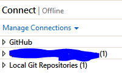
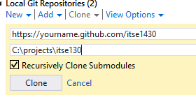
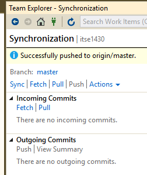
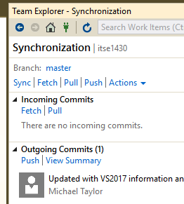

# Git Basics

Git is a file-based distributed version control system. Git uses the concept of a repository to group related files together into a folder structure. Users make changes to the repository locally and then push those changes up to Git when they are ready for others to see the changes. Git tracks changes to files based upon differences rather than tracking the actual changes. This results in Git being able to quickly identify modifications without the need for determining the actual changes. Since a user may not be ready to push changes for a while Git allows a user to store changes locally (committing) and have them pushed later. A single push can have any number of associated commits.

Because Git is file based each user on each machine must get a copy of a repository before any work can be done (cloning). Once a repository has been cloned metadata is available to allow Git to work properly from then on. It is possible to reclone a repository but this generally involves deleting the existing local directory first and is rarely needed.

Git supports using the command line, the web interface or Visual Studio for interactions. We will focus on using Visual Studio.

*Note: You can determine if you are in a repository directory by looking for the hidden .git folder. This folder is always present and represents the local git repository. Never modify this folder or its contents.*

*Note: Git works on files, not folders. If you have empty folders then they are not committed. If you have a folder with no files in it then it will be ignored.*

## Cloning a Repository

*Note: Cloning a repository is only necessary the first time a new repository is used on a machine or if the local repository folder is deleted. Thereafter cloning is not necessary.*

In order to work with a repository locally you need to clone it. Cloning a repository will set up the structure needed by git and will download the repository to your machine. This will generally only need to be done once per repository per machine. If you ever wipe out the directory structure you will need to repeat this process.

1. Open Visual Studio and go to Team Explorer.
2. Click on ```Projects \ Manage Connections```. 
3. You should see a ```Local Git Repositories``` list with options to New \ Add \ Clone repositories.



4. At this point you may be prompted to sign into Git.
5. Click the ```Clone``` option and enter the URL to the repository you are cloning and the local path you will be storing it in. Each repository must be in its own folder path. 



6. Clicking ```Clone``` will download the repository.

## Opening a Repository

When opening Visual Studio back up you will need to open the repository containing your code.

1. Open Visual Studio and go to Team Explorer.
2. Click on ```Projects \ Manage Connections```. 
3. You should see a ```Local Git Repositories``` list with options to New \ Add \ Clone repositories.
4. The repositories you have already cloned will appear. 
5. Double click the desired repository to open it.

Visual Studio will now be connected to the repository. To save you some time Visual Studio will return to the home page for Team Explorer. At the bottom of the page is a list of the solutions you have in the repository. You can either double click the desired solution (if it already exists) or create a new solution. 

Because you have a repository open all changes will be tracked. It is strongly recommended that you pull your repository before making any further changes.

*Note: It is critical that you keep all changes in your repository within the folder structure of your repository. Failure to do so will cause Git to miss the changes.*

## Pull a Repository

*Note: Always pull your repository before starting any work to ensure you do not run into issues pushing your changes later.*

Pulling a repository will download any changes from Git to your local copy. Since Git tracks changes only those differences need to be downloaded. It is important that you do this before making any other changes otherwise you may run into merge issues with pushing changes later.

1. From the home tab of Team Explorer click the ```Sync``` option.


2. On the ```Synchronization``` tab click the ```Pull``` link to pull down any changes. It doesn't matter which ```Pull``` link you use.
3. Git will report any changes that were downloaded.

You can now make changes to your repository knowing you have the latest version locally. Any changes made by others (or yourself on another machine) will now be available locally.

## Pushing Changes

When you have made the changes are want to make them permanent you need to commit them and then push them to Git. Git follows a 2-step process for pushing changes. The first step commits the changes from your working folder to a local copy. At this point the changes are not available in Git but will be part of the changes that are sent. The second step is to push the changes. This will copy any commits from your local machine to Git. Once pushed others will have access to your changes. 

*Note: This two step process always occurs but since you will often commit and push at the same timeVisual Studio provides a shortcut command to do both at once.*

1. From the home tab of Team Explorer click the ```Changes``` option.


 
2. Git will analyze the differences between the files since your last commit. Any differences will be listed. At this point you can undo changes you've made or commit your changes.
3. To commit the changes you must enter a comment about what changes you've made. This information will be available later to explain why the changes were made.
4. Since you will often be committing and pushing the changes together click the drop down arrow next to the ```Commit All``` button and select ```Commit All and Push```. This will commit and then push the changes at once.
5. Assuming everything is successful then Git will be updated with your changes. 



## Pushing Changes after Commit

On occassion the commit and push may fail because of a merge conflict or for other issues. In this case the files have been committed locally and therefore no longer appear under the ```Changes``` tab. In this case you will need to resolve the issue and try to push again. To push an existing committed change do the following.

1. From the home tab of Team Explorer click the ```Sync``` option.


 
2. Under the ```Outgoing Commits``` section you will see one or more commits that have not successfully been pushed yet.



3. To push all the outgoing commits click the ```Push``` link. This will attempt to push the commits again.

## Common Push Issues

In general errors will occur when pushing if they are going to occur. That is because you are trying to communicate with Git. There are several common issues that can occur. 

The first step in diagnosing the issue is looking in the ```Team Explorer``` window at the error that is displayed. It will often explain the exact issue. The other place to look is in the ```Output``` window of Visual Studio under the ```Source Control - Git``` category.

### Authentication

When you connect to Git you must have permissions to perform the action you are requesting. Reads are almost always available to everyone and will work but pushing changes requires write access. If you receive an access denied or 403 error then this means your user account is incorrect. To correct this, log back in.

1. Go back to the ```Manage Connections``` tab of ```Team Explorer```.
2. Under ```GitHub``` is a ```Sign In/Out``` link. 
3. Sign out, if necessary, and then sign back in.
4. Try pushing again.

### Merge Conflicts

If you try to push changes to Git and one of the files that has changed was modified elsewhere and you didn't pull the changes first then you will get a merge conflict. In most cases you will need to manually merge the changes. 

1. Pull the changes from Git.
2. Use the merge option to merge the changes.
3. Commit the merge changes.
4. Try pushing again.

 

